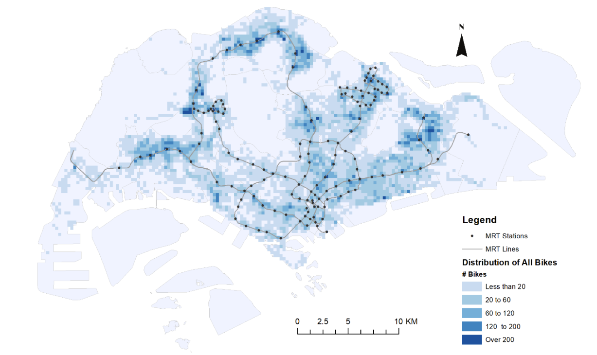

# bikesharing-relocation
This is a repository for processing trip data into flow data between OD and visualize the demand fluctuation on certain day. The region is discretized into cells and flow is count by cell. See the following picture for a example of the partition of the region:

In the above picture, density is count by cells (the little squares in the picture). We do the similar thing for flow by using the discretized cells as origin and destination of trips.The output flow data file has the following field:

* cell_start, cell_end: the id of the strat cell and end cell
* dayofweek: day of the week of the trip, 0 for Sunday, 1 for Monday and so on
* date: date of the trip
* start_hour: the hour that the trip starts, range from 0-23
* bike_id: number of bikes (flow)
## Getting started

### Dependencies
The scripts are implemented in python. Pandas, Numpy, matplotlib are required for execution. If you are using Anaconda, these should all have been pre-installed.

### Data description
The sample_data.csv is composed of trip data. In the data file, every row stands for a trip and has the following fields:
* bike_id, a unique string for each bike
* time_stamp_ori, time_stamp_dst: the start and end time of the trip in seconds from 1970-1-1
* lng0, lat0: longitude and latitude of the trip start position in WGS84 coordinate system
* lng1, lat1: longitude and latitude of the trip end position in WGS84 coordinate system
* time_duration: time duration of the trip in seconds
* trip_distance: distance of trip in km
* speed: average speed of trip in km/s, calculated by trip_distance/time_duration

## Executing
* run get_demand.py, you can get a new csv file named flow_result.csv which stores the flow between OD
* after run get_demand.py, run demand_visulization.py and you can get an image in the same directory named "demand_fluctuation_on_2017_10_4.png"

To get the flow result from other original data (needs to be in the same form with sample_data.csv), put the data file and get_demand.py in one folder. If your file is with a different name, go to get_demand.py and demand_visualization.py then change the first line of name of file to read. 

If you want to get image of demand fluctuation for another day, go into demand_visualization.py and change the date you want to visualize in the last line.

## Authors
[Xinling Li](mailto:li.xinling@epfl.ch)

## License
CC-BY

## Acknowledgments

The processing and discritization methods are inspired by a paper of Yu Shen. Click the link for more information:
[Understanding the usage of dockless bike sharing in Singapore](https://www.tandfonline.com/doi/abs/10.1080/15568318.2018.1429696)
